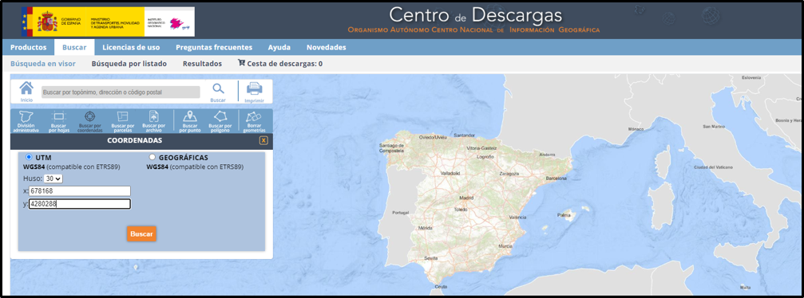
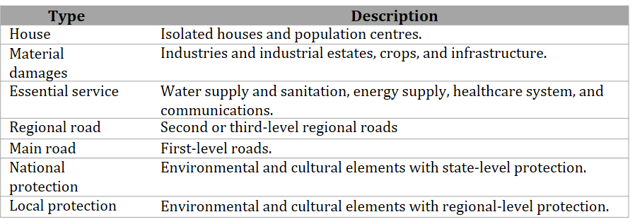

# ACROPOLIS: User Manual
To use the application, the user must perform a pre-processing step, which involves estimating the input data for the model, collecting terrain details, and locating the areas of concern to evaluate.
This manual provides a step-by-step guide for the user, from data pre-processing to estimating the reservoir classification.
# 1. Pre-process:
The pre-processing is divided into four parts: 1) Downloading the digital elevation model (DEM), 2) Assigning roughness, 3) Locating affected areas, and 4) Estimating physical parameters.

## 1.1 Digital Elevation Model (DEM):
There are various portals and tools available for downloading digital elevation models. In Spain,  the [Download Center of the National Geographic Institute (IGN)](https://centrodedescargas.cnig.es/CentroDescargas/index.jsp), offers free access to geographic information. By providing the reservoir's coordinates, users can search for and download the corresponding DEM.
 
Typically, the downloaded files are in ASCII format. The tool can directly read these files or, if preferred, users can opt for the TIF format. It is advisable for users to review the downloaded file using GIS software, such as [QGIS](https://www.qgis.org/en/site/forusers/download.html). This allows them to crop the DEM if desired. Note that processing time may increase for larger DEMs.

## 1.2 Roughness:
One of the input parameters is the Manning coefficient, which is related to land use. Users can refer to the [Methodological Guide for the Development of the National System of Flood Zone Cartography](https://www.miteco.gob.es/es/agua/publicaciones/guia_snczi_baja_optimizada_tcm30-422920.pdf), where Appendix V provides the assigned Manning coefficient associated with land uses (CORINE). If the user wants more detailed information about land use in the area surrounding the reservoir, it is possible to download the land cover map of Spain from the Download Center. 

## 1.3 Areas of Interest (AoI):
According to Spanish regulations, the level of risk must be assessed in the areas surrounding the off-stream reservoir that may be in danger in the event of failure. Residential areas, urban centers, agricultural zones, and natural parks, among others, should be evaluated. The user must prepare a comma-separated values (*.csv) file with four columns: ID, x, y, and type. The ID column corresponds to the assigned number of the point, "x" and "y" represent the coordinates (EPSG 25830 or EPSG 25831), and the type describes the vulnerable area. The type column can be filled with 7 options. The Table 1 presents the possible options and their descriptions. The application takes into account the type of vulnerable area to estimate the reservoir classification.
Table 1. Types of AoI

The user can extract the coordinates for each affected area using Google Earth or QGIS. The following are the steps to extract coordinates using QGIS:
1. Create a new connection in the XYZ Tile, and add the URL of the Google Maps terrain layer. Add the new layer to the canvas.
2. Create a new vector layer (Layer / New Layer / New Vector Layer); select "point" as the geometry type, and set the projection (EPSG:32630-WGS84 UTM 30 N or EPSG:25831-WGS84 UTM 31 N).
3. Edit the new layer and add points at the location of the affected areas (i.e., houses, roads, crops), and save the changes.
4. Export the layer as a CSV file.

## 1.4 Physical parameters:
The Machine Learning model integrated into the interface was trained with 15 input variables based on synthetic geometry. To apply the model to real cases, a conversion from synthetic parameters to real terrain is required. Figure 4 shows the diagram of the synthetic geometry, which is located in the Project menu of the interface. The user must manually enter the displayed variables, taking into account the indicated units.

