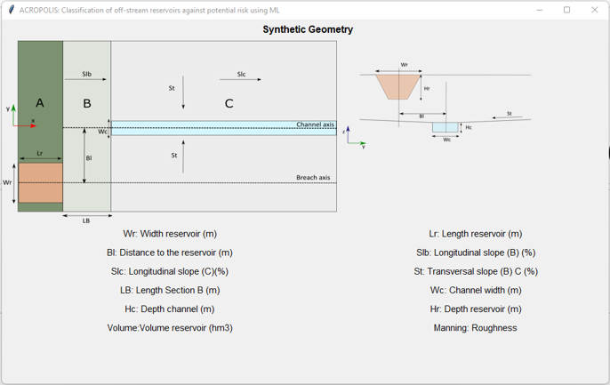
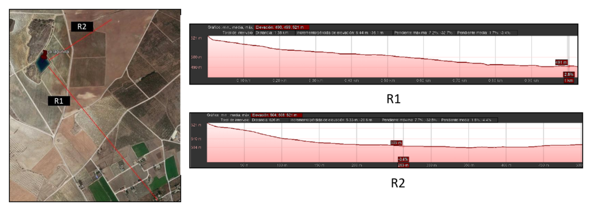
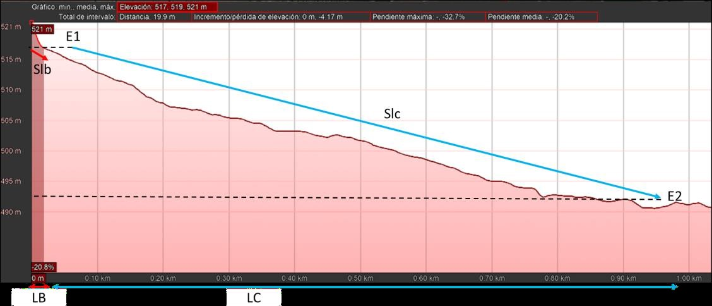
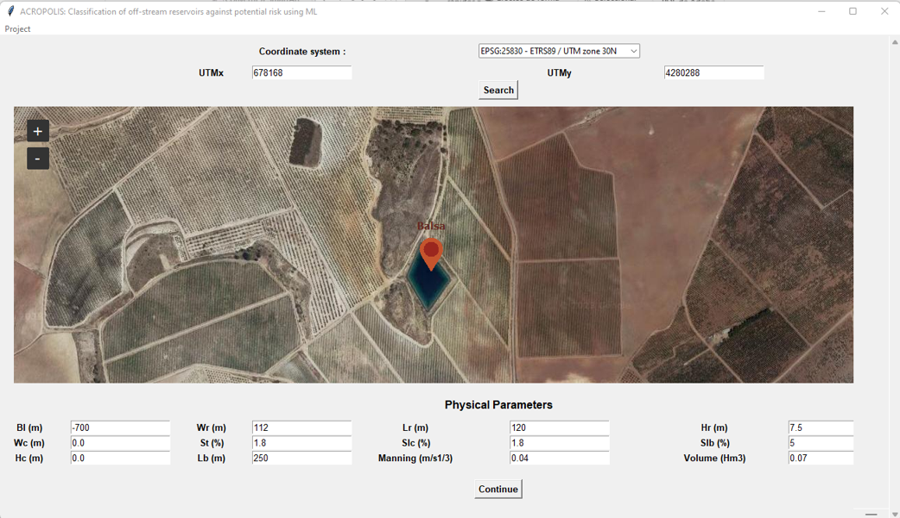
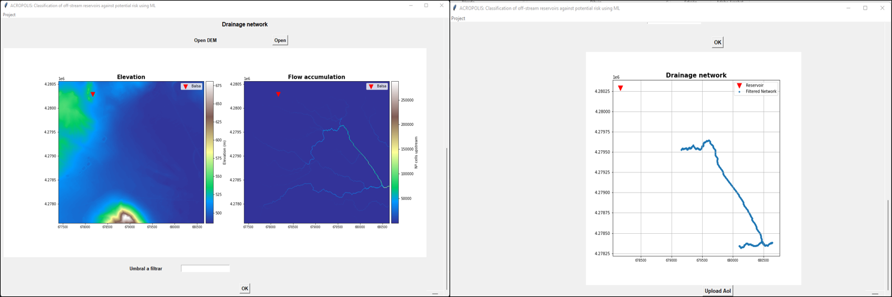
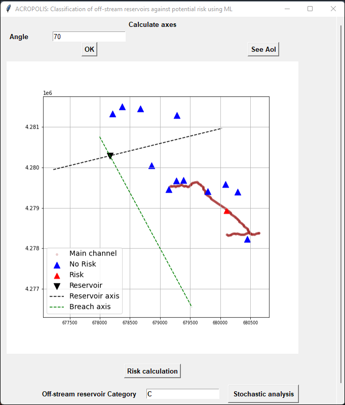

# ACROPOLIS: User Manual
To use the application, the user must perform a pre-processing step, which involves estimating the input data for the model, collecting terrain details, and locating the areas of concern to evaluate.
This manual provides a step-by-step guide for the user, from data pre-processing to estimating the reservoir classification.
# 1. Pre-process:
The pre-processing is divided into four parts: 1) Downloading the digital elevation model (DEM), 2) Assigning roughness, 3) Locating affected areas, and 4) Estimating physical parameters.

## 1.1 Digital Elevation Model (DEM):
There are various portals and tools available for downloading digital elevation models. In Spain,  the [Download Center of the National Geographic Institute (IGN)](https://centrodedescargas.cnig.es/CentroDescargas/index.jsp), offers free access to geographic information. By providing the reservoir's coordinates, users can search for and download the corresponding DEM.

Figure 1. Download Center of the National Geographic Institute
 
Typically, the downloaded files are in ASCII format. The tool can directly read these files or, if preferred, users can opt for the TIF format. It is advisable for users to review the downloaded file using GIS software, such as [QGIS](https://www.qgis.org/en/site/forusers/download.html). This allows them to crop the DEM if desired. Note that processing time may increase for larger DEMs.

## 1.2 Roughness:
One of the input parameters is the Manning coefficient, which is related to land use. Users can refer to the [Methodological Guide for the Development of the National System of Flood Zone Cartography](https://www.miteco.gob.es/es/agua/publicaciones/guia_snczi_baja_optimizada_tcm30-422920.pdf), where Appendix V provides the assigned Manning coefficient associated with land uses (CORINE). If the user wants more detailed information about land use in the area surrounding the reservoir, it is possible to download the land cover map of Spain from the Download Center. 

## 1.3 Areas of Interest (AoI):
According to Spanish regulations, the level of risk must be assessed in the areas surrounding the off-stream reservoir that may be in danger in the event of failure. Residential areas, urban centers, agricultural zones, and natural parks, among others, should be evaluated. The user must prepare a comma-separated values (*.csv) file with four columns: ID, x, y, and type. The ID column corresponds to the assigned number of the point, "x" and "y" represent the coordinates (EPSG 25830 or EPSG 25831), and the type describes the vulnerable area. The type column can be filled with 7 options. The Table 1 presents the possible options and their descriptions. The application takes into account the type of vulnerable area to estimate the reservoir classification.

Table 1. Types of AoI

The user can extract the coordinates for each affected area using Google Earth or QGIS. The following are the steps to extract coordinates using QGIS:
1. Create a new connection in the XYZ Tile, and add the URL of the Google Maps terrain layer. Add the new layer to the canvas.
2. Create a new vector layer (Layer / New Layer / New Vector Layer); select "point" as the geometry type, and set the projection (EPSG:32630-WGS84 UTM 30 N or EPSG:25831-WGS84 UTM 31 N).
3. Edit the new layer and add points at the location of the affected areas (i.e., houses, roads, crops), and save the changes.
4. Export the layer as a CSV file.

## 1.4 Physical parameters:
The Machine Learning model integrated into the interface was trained with 15 input variables based on synthetic geometry. To apply the model to real cases, a conversion from synthetic parameters to real terrain is required. Figure 4 shows the diagram of the synthetic geometry, which is located in the Project menu of the interface. The user must manually enter the displayed variables, taking into account the indicated units.

Figure 2. Synthetic geometry

Generally, the user is aware of the dimensions of the reservoir (Wr, Hr, Lr, and Volume) and the estimation of the Manning coefficient was explained in section 1.2. Therefore, it is necessary for them to calculate the other 8 variables. [Google Earth Pro](https://earth.google.com/web/) is a freely available tool that provides the necessary tools to estimate the missing parameters.

### 1.4.1 Breach location:
By locating the reservoir in Google Earth and using the Add Path tool, the user can draw different paths where they want to evaluate the reservoir breach. For example, the Figure 3 shows two breaches (R1 and R2) in the La Lagunilla reservoir. The user can perform the analysis with the desired breach. For the sake of simplicity in this manual, the analysis will be performed with breach R1.

Figure 3. Examples of breach locations for La Lagunilla off-stream reservoir (Google Earth)

### 1.4.2 Distances and slopes:
With a clear understanding of the breach direction and by observing the elevation profile, three physical parameters can be estimated: LB, Slb, and Slc, which correspond to the length of section B (Figure 2) (transition zone) and the longitudinal slopes. Figure 3 shows the selected lengths for LB and LC. Although LC is not an input parameter, it is useful for calculating the slope Slc.  To calculate the longitudinal slopes, the following equation can be utilized: Slc=(E1-E2)/LC*100.

Figure 4. Example selection of the parameters on the terrain profile of the breach axis

To estimate the transverse slope (St), the user can draw multiple profiles crossing perpendicular to the breach axis. By following the same procedure as for the longitudinal slopes, it is possible to estimate the transverse slope. Additionally, with the cross-sections, it is possible to observe if there is a preferential  channel and the direction of flow. Using the same elevation profile, the dimensions of the channel can be estimated, along with the BL distance.

# 2. Application of the tool
## 2.1 Main window:
The main window of the interface consists of a Project menu, where the corresponding information regarding the physical parameters and synthetic geometry is located. At the top, there is an option for the coordinate system, where you can choose the system in which you want to work. The options include the two systems used in Spain: EPSG:25830 - ETRS89 / UTM zone 30N and EPSG:25831 - ETRS89 / UTM zone 31N.
It is important to select the coordinate system in which the information was extracted during the pre-processing (sections 1.1 and 1.3).

In the UTMx and UTMy fields, the user enters the coordinates of the reservoir, and upon clicking the Search button, the viewer will display the location of the reservoir. Then, fields are shown to enter the physical parameters of the reservoir, which the user estimated during the processing (sections 1.2 and 1.4).

Figure 5. Physical parameters and location Lagunilla off-stream reservoir

Once the data is completed and the Ok button is clicked, the section for loading the DEM file obtained in section 1.1 will appear at the bottom. The application allows the loading of TIF or ASCII files. 
The interface internally processes the DEM, filling depressions and removing peaks. It calculates the flow direction in each pixel and finally computes the accumulation, which is defined as the amount of area (in terms of the number of cells or pixels) drained into each cell.  The main objective of calculating terrain accumulation is to identify the main drainage network around the reservoir. This network determines the direction in which the breach wave propagates.

At the bottom of the accumulation map, the user must enter the "Threshold to Filter," which corresponds to the maximum number of accumulated cells they wish to extract (as a rule, the minimum value on the color scale can be used). The user can try different thresholds, and upon clicking "OK", the filtered drainage network graph will appear at the bottom and update each time the threshold is changed. Figure 6 shows the filtered network of La Lagunilla.

Figure 6. Flow accumulation and filtered network Lagunilla

## 2.1 Calculation window and results:
When clicking on "Upload AoI," the interface will prompt the user to select the file containing the condition information, and only files with the extension *.csv are allowed. This file is prepared during the processing phase (Section 1.2). The interface loads the document and opens a second window. 

The window displays a graph with the locations of the conditions and the extracted drainage network (Figure 7). The drainage network represents the axis of the main channel of the synthetic geometry. To represent the axis of the selected breach in the preprocessing stage (Section 1.4.1), the interface requests the user to specify the angle at which the breach is located, with the location of the reservoir as the origin. The selected angle must ensure that the breach axis is parallel to the drainage network, just as it is in the synthetic geometry (Figure 2). The button "See AoI" opens a new window showing a Google Earth viewer with the locations of the AoI.

Figure 7. Location of AoI and axes Lagunilla

## 2.1 Calculation of risk and classification of the off-stream reservoir:
When calculating the breach axis, a new button appears at the bottom. When clicking on "Risk calculation," the interface uses the ML model and classifies each of the conditions as "Risk" or "Not Risk." With this classification and considering the type of condition, the dam is classified accordingly.

