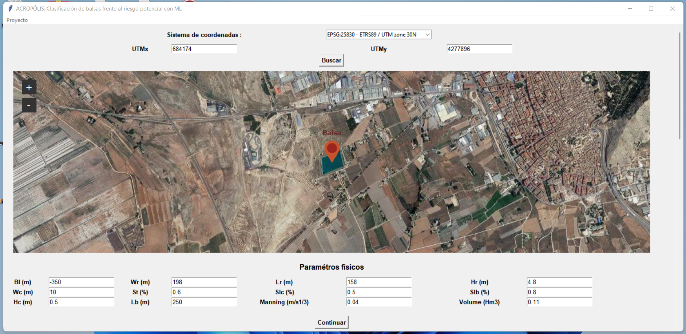

# ACROPOLIS

ACROPOLIS is a  tool designed for the classification of risk associated with off-stream reservoirs. Utilizing a  Machine Learning algorithm, the tool offers a fast and efficient method for the preliminary estimation of risk classification in these reservoirs (Silva-Cancino et al., 2022). Its incorporation of advanced technology enables users to swiftly assess and categorize risk levels, providing valuable insights for reservoir management and decision-making processes.
