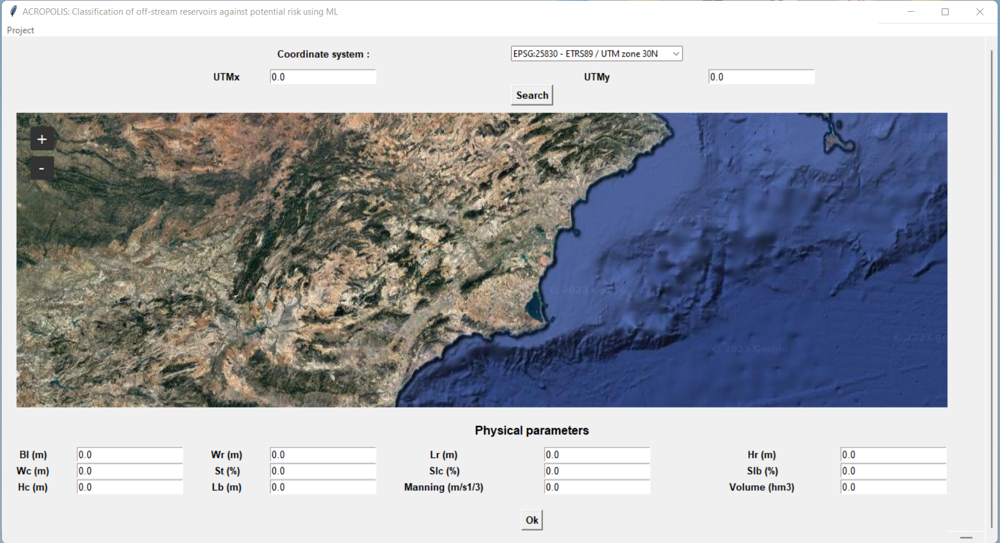
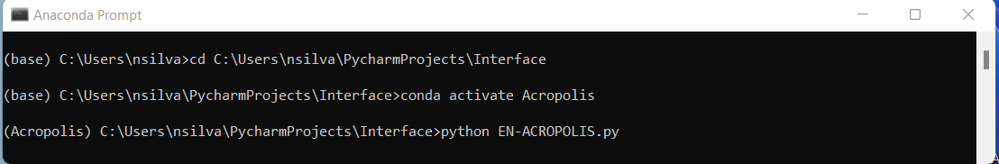

# ACROPOLIS: Classification of risk of off-stream reservoirs

ACROPOLIS is a  tool designed for the classification of risk associated with off-stream reservoirs. Utilizing a  Machine Learning algorithm, the tool offers a fast and efficient method for the preliminary estimation of risk classification in these reservoirs [(Silva-Cancino et al., 2022)](https://www.mdpi.com/2073-4441/14/15/2416?utm_campaign=releaseissue_waterutm_medium=emailutm_source=releaseissueutm_term=doilink114). Its incorporation of advanced technology enables users to swiftly assess and categorize risk levels, providing valuable insights for reservoir management and decision-making processes.

## The software tool provides:
1. Visualization of the flow accumulation based on a Digital Elevation Model (DEM)
2. Classification of areas of interest (AoI) as "risk" or "not risk".
3. Overall classification of risk of the off-stream reservoir (A, B or C)
4. Stochastic analysis

## Prerequisites 
* [Python 3.8](https://www.python.org/downloads/release/python-380/)
* [Anaconda](https://www.anaconda.com/download)

 ## Installation  
* Download folder Scripts and the [ML model](https://drive.google.com/file/d/1LAI0xOYKKjGAjZYNjWS_DYsMXkeV5zJR/view?usp=drive_link), save the files in the same folder on your computer.
* Open Anaconda Navigator, select the Environments tab and click on Import. Choose the Acropolis.yml file.
  
*Open Anaconda Prompt and type: conda activate Acropolis. Upon pressing enter, Anaconda will select the environment we imported in the previous step.
*On the next line, type: Python EN-ACROPOLIS.py, press enter, and the interface will open. Make sure that the files inside Scripts are in the same folder shown in Anaconda Prompt, or else change the directory accordingly.
  
